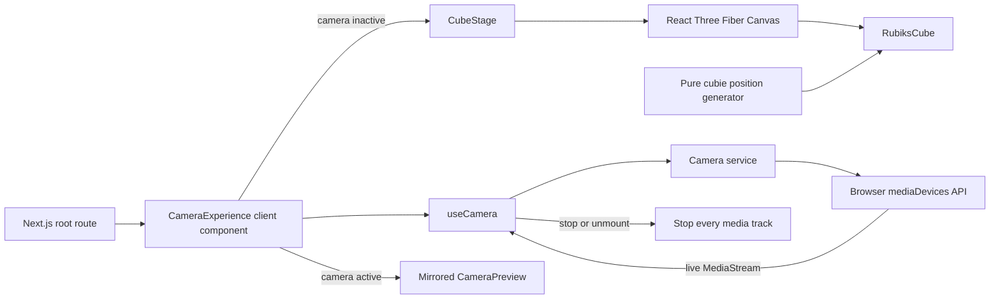
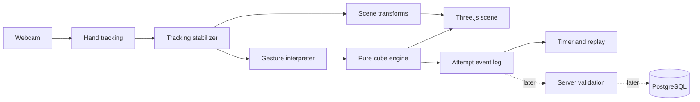

# 3D Cube Learn — Architecture

**Status:** Current through M1; later milestone boundaries remain proposed

**Last updated:** 2026-09-30

## 1. Architectural goal

Keep real-time interaction responsive and private in the browser while isolating cube rules from rendering. Add server authority only when timed ranked attempts require identity, validation, and persistence.

The architecture should be understandable as a pipeline rather than a collection of framework features.

The implemented path through M1 is intentionally small:



Everything after this rendering path is introduced only when its milestone becomes active.



## 2. Technology responsibilities

| Technology | Responsibility | Does not own |
|---|---|---|
| Next.js | Application shell, routing, and later server endpoints | Hand inference or cube rules |
| React | User interface and durable view state | Frame-by-frame landmark data |
| Three.js | 3D scene objects, cameras, materials, lighting, and animation | Authoritative cube state |
| React Three Fiber | React integration for the Three.js canvas and render loop | Computer vision or business rules |
| MediaPipe Hand Landmarker | Browser-side hand landmark inference | Gesture intent or cube moves |
| Pure TypeScript modules | Cube state, legal moves, gesture state machine, event schemas | Rendering |
| PostgreSQL/Supabase, later | Accounts, attempts, results, and leaderboard persistence | Webcam frames or raw landmarks |

## 3. Near-term client pipeline

### Rendering

M0 renders a cube without camera or tracking dependencies. `app/page.tsx` now mounts `CameraExperience`, which shows `CubeStage` whenever the camera is inactive. `CubeStage` owns the React Three Fiber canvas, camera, lights, and orbit controls. `RubiksCube` owns the rendered cube composition. A pure TypeScript helper generates the 27 unique cubie positions and is tested without React or WebGL.

### Camera

M1 implements camera work as three small boundaries. `camera-service.ts` requests video without audio, prefers a 1920×1080, 16:9, 30-fps user-facing stream without making those settings mandatory, stops every track, and converts browser errors into application failure states. `use-camera.ts` owns the idle/requesting/active/denied/unavailable/error state machine and guarantees cleanup on stop, a stale request, or unmount. `CameraPreview` attaches the resulting stream directly to a mirrored `<video>` element.

The stream reference exists in React state only when it starts or stops so the preview can render. Video frames never enter React state, are never uploaded, and are never persisted. Hiding or removing the video element is not considered cleanup; the stream tracks must be stopped.

### Tracking

The tracking adapter will translate MediaPipe output into an application-owned landmark format. This prevents the rest of the app from depending directly on a specific vision-library response shape.

### Stabilization

The stabilizer will smooth noisy landmark positions, maintain handedness continuity, gate low-confidence frames, and emit explicit tracking-loss events.

### Gestures

The gesture interpreter will be a temporal state machine. It will convert a sequence of stabilized observations into semantic commands such as `pinch_started`, `turn_previewed`, `turn_committed`, and `turn_cancelled`.

### Cube engine

The cube engine will be pure TypeScript. Given an initial state and a legal move, it will produce the next state. Both the browser and later server validator must use the same versioned rules.

### Rendering bridge

The scene will read cube state and smoothed transforms and display them. High-frequency positions should be stored in mutable refs or a purpose-built external store so React does not rerender the entire interface for every camera frame.

## 4. Later full-stack boundary

The backend is intentionally deferred until the interaction demo works, but the future boundary is defined now:

- Browser: camera, landmarks, gestures, rendering, responsive timer, and attempt-event collection
- Server: authentication checks, scramble issuance, attempt lifecycle, validation, rate limits, and leaderboard reads
- Database: public profiles, scrambles, attempts, semantic events, and accepted results

Camera frames and raw landmarks do not cross the client/server boundary.

## 5. Current and planned project structure

The repository currently contains only the boundaries required through M1:

```text
app/
  layout.tsx                # document shell and metadata
  page.tsx                  # root route; mounts the camera experience
  globals.css               # full-window stage, preview, status, and controls
components/
  camera-experience.tsx     # camera UI states and stage/preview switching
  camera-preview.tsx        # MediaStream-to-video attachment and mirrored view
  cube-stage.tsx            # client canvas, camera, lights, and orbit controls
  rubiks-cube.tsx           # cubie meshes and solved face colors
features/
  camera/
    camera-service.ts       # media request, cleanup, and browser-error mapping
    camera-service.test.ts  # video-only, all-track cleanup, and failure tests
    use-camera.ts           # React camera lifecycle state machine
lib/
  cube/
    cubie-positions.ts      # pure 3×3 coordinate generation
    cubie-positions.test.ts # focused non-visual unit test
```

Later boundaries remain a guide and should be created incrementally:

```text
app/
  api/                      # later server endpoints
features/
  tracking/                 # MediaPipe adapter and smoothing
  gestures/                 # intent state machine
  cube/                     # scene bridge and controls
  attempts/                 # timing and semantic events
  replay/                   # later spectator experience
lib/
  cube-core/                # pure state and legal moves
  server/                   # later auth and persistence helpers
```

Only directories required by the active milestone should exist.

## 6. State ownership rules

- React owns menus, camera permission status, errors, active modes, the stream reference used to mount the preview, and other human-scale UI state.
- The camera service owns browser permission requests, browser-error translation, and the rule that every media track must be stopped.
- The tracking loop owns per-frame landmark observations.
- The stabilizer owns filtered transforms and confidence history.
- The cube engine owns the authoritative cube configuration.
- Three.js owns only scene objects and transitional visual animation.
- The attempt recorder owns the ordered semantic event stream.
- The server owns whether a ranked attempt is accepted.

## 7. Verification strategy

- Current cubie-position logic: deterministic Vitest unit test
- Current 3D stage: production build plus a real-browser orbit, zoom, resize, and console smoke test
- Current camera lifecycle: deterministic service tests plus a real-browser permission, live-preview, stop, and unmount smoke test
- Future pure cube and gesture logic: deterministic unit tests
- React UI states: focused component tests
- Camera/tracking adapters: fixtures plus manual testing with a real webcam
- Primary user journeys: browser automation when stable
- Visual alignment and interaction quality: explicit browser smoke tests on a baseline laptop
- Server authorization and validation: integration tests and database-policy tests when backend work begins

## 8. Known architectural risks

- A single webcam does not provide reliable absolute depth.
- Hand crossing and occlusion may swap identity or confidence.
- React rerenders can compete with inference and rendering if per-frame data is modeled incorrectly.
- Gesture ambiguity may require a more constrained interaction than the product vision initially imagines.
- The replay avatar can look physically wrong even when cube state is correct.

The build order attacks the first four risks before investing in backend or replay production.
