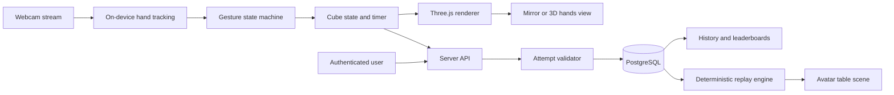

# 3D Cube Learn — Product Requirements Document

**Status:** Draft v0.3

**Product stage:** Concept / technical prototype

**Primary platform:** Full-stack desktop web application

## 1. Product summary

3D Cube Learn is a browser-based learning experience that lets someone practice manipulating and eventually solving a Rubik's-style 3×3 cube without owning a physical cube.

The user grants camera access and holds their empty hands in front of the webcam. The app tracks both hands and renders a virtual cube between them. Hand movements and deliberate gestures let the user rotate the cube and turn its layers.

The experience has two display modes powered by the same live camera tracking:

1. **Mirror view:** The user sees their mirrored webcam feed with the virtual cube composited between their real hands.
2. **3D hands view:** The webcam feed is hidden and replaced by computer-rendered hands that mirror the user's tracked motion. The camera remains active for tracking.

The full product adds accounts, timed solves, validated results, personal history, public leaderboards, and cinematic 3D attempt replays. After an attempt, the user can watch a seated avatar reproduce the recorded cube moves at a competition-style table. The long-term learning experience teaches cube-solving step by step. Delivery remains staged so the hand interaction is proven before competitive features depend on it.

## 2. Product vision

Make learning and practicing a physical spatial skill possible with only a laptop and a webcam.

The product should feel less like operating a 3D model and more like holding an object that happens not to be physically present.

After learning, a user should have a reason to return: improve a personal best, complete a daily challenge, and compare validated solve times with other learners.

Every attempt should also become something the learner can study: where they paused, which moves they made, and how the solve unfolded over time.

## 3. Problem and opportunity

Most digital cube simulators are controlled with a mouse, keyboard, or touchscreen. They can teach algorithms, but they do not develop the spatial relationship between a learner's hands and the cube.

3D Cube Learn explores a different interaction model: the learner uses the same broad hand motions they would use with a real cube. This creates a more embodied, memorable, and accessible entry point for someone who does not own one.

The largest product risk is not rendering the cube. It is correctly inferring user intent without physical contact or haptic feedback. The MVP must therefore favor a small number of clear, reliable gestures over attempting to recognize every natural cube movement immediately.

## 4. Target user

### Primary user

A beginner who is curious about solving a Rubik's-style cube, has access to a laptop or desktop webcam, and does not currently have a physical cube.

### Returning user

A learner who can already complete a virtual solve and wants to practice for a faster time, track personal improvement, or participate in a friendly leaderboard.

### Initial usage context

- Seated or standing in front of a laptop or desktop webcam
- Both hands visible from roughly the wrist upward
- Typical indoor lighting
- Enough space to move both hands without leaving the camera frame
- A modern desktop browser with WebGL and camera support

## 5. Product principles

1. **Presence before instruction.** First make the cube feel like it is in the user's hands; add solving lessons after the interaction is trustworthy.
2. **Intentional gestures over magical guesses.** A small gesture vocabulary with clear feedback is better than frequent accidental turns.
3. **Private by default.** Camera frames should be processed locally and should not be uploaded or recorded.
4. **Always explain tracking state.** The user should know whether the app sees zero, one, or two hands and what to do next.
5. **The cube state is authoritative.** Visual animation may be interrupted, but every completed move must result in a valid, reproducible cube state.
6. **Competition should be understandable.** A ranked result must clearly show how it was timed, validated, and accepted or rejected.
7. **The server validates; it does not watch.** Ranked validation uses scrambles, move events, timing metadata, and cube state—not camera recordings.
8. **Record actions, not appearance.** Replays are reconstructed from semantic cube events by default, not from recorded webcam video or biometric motion data.

## 6. Scope

### 6.1 Prototype milestone: “Cube in my hands”

This is the first technical proof, not the complete MVP.

- Ask for webcam permission after a user action.
- Show a mirrored camera feed.
- Detect and track up to two hands.
- Place a solved virtual 3×3 cube at a stable position between the hands.
- Smooth tracking enough that the cube does not visibly jitter while the hands are mostly still.
- Show helpful states when hands are missing or tracking confidence is low.
- Toggle between Mirror view and a basic 3D hands view without stopping the camera stream.

### 6.2 Interactive MVP: “I can make a real move”

The MVP is successful when the prototype also supports a small, dependable interaction loop:

- Recenter and scale the cube using the position of both hands.
- Use a pinch-and-drag gesture to select a visible cube face and turn one layer.
- Snap a committed layer turn to exactly 90 degrees.
- Cancel an incomplete or low-confidence gesture without changing cube state.
- Rotate the whole cube using a separate, deliberately distinct gesture or guided control.
- Preserve valid cube state across repeated moves.
- Undo the last move and reset to a solved cube.
- Provide a short interactive onboarding sequence for hand placement and the supported gestures.

### 6.3 Full-stack product MVP: “My solve counts”

Once the interactive MVP is reliable, the first complete product release adds:

- Account creation, sign-in, sign-out, and a unique public display name
- A practice mode that works without affecting rankings
- A ranked timed mode for signed-in users
- Server-issued scramble sequences and attempt identifiers
- A responsive local timer that starts on the first committed move and stops automatically when the cube engine reaches a solved state
- Submission of the scramble, ordered move log, relative move timestamps, tracking-health summary, and final cube state to the server
- Server-side replay of the move sequence before a result is accepted
- A versioned semantic attempt-event log that can also drive deterministic replay
- Accepted, rejected, and abandoned attempt states with a clear explanation to the user
- Personal solve history and personal-best time
- A public leaderboard containing only accepted ranked attempts
- A daily challenge in which eligible users receive the same scramble

The app may show a result confirmation screen, but the user does not need to press a button at the exact finish moment. Successful solve detection stops the timer automatically.

### 6.4 Replay experience: “Watch what I did”

A post-attempt replay is available after a solved or incomplete attempt containing at least one committed move.

The replay scene shows:

- A stylized 3D person seated at a table
- A virtual cube initialized to the attempt's original scramble
- A competition-inspired timer mat with two hand pads and a digital time display
- The avatar's hands beginning on the timer pads, lifting as the solve begins, manipulating the cube, and returning to the pads when a completed solve ends
- The same committed cube moves, whole-cube rotations, pauses, and relative timing recorded during the attempt
- The final result: accepted time, unranked completion, incomplete attempt, abandoned attempt, or rejected submission
- Playback controls for play/pause, scrubbing, restart, playback speed, camera orbit, and move-list visibility

The first replay version recreates the user's **move sequence, active hand, and pace**, not their exact body mechanics. Each cube notation event maps to an authored or inverse-kinematics-assisted avatar animation. This produces a coherent performance without storing raw hand landmarks.

An exact-motion replay—where the avatar mirrors the user's original finger and wrist trajectories—would require a separate, explicit opt-in design for sampling, compressing, retaining, and deleting motion data. It is not required for the initial replay feature.

### 6.5 Explicitly out of scope for the product MVP

- Step-by-step solving lessons or a solving algorithm
- Recognizing every natural way someone might manipulate a physical cube
- Photorealistic hands, finger-to-cube collision, or haptic feedback
- Perfect hand/cube occlusion in all poses
- Mobile and tablet support
- Multiplayer or shared sessions
- Friends, direct messaging, reactions, or other social-network features
- Cash prizes or a competition-grade anti-cheat guarantee
- Uploading solve videos for manual review
- Exact reproduction of the user's body, face, fingers, or biomechanics in replay
- Public replay sharing or live spectating
- Training a custom computer-vision model
- Voice control

## 7. Core user journey

1. The user lands on a simple explanation of the experience and its camera privacy behavior.
2. The user selects **Start with camera**.
3. The browser asks for camera permission.
4. The app loads hand tracking and shows a framing guide.
5. The user raises both hands with palms roughly facing each other.
6. Once both hands are detected, a solved cube appears between them.
7. A brief onboarding prompt teaches the pinch-and-drag gesture.
8. The user turns one layer and sees it snap into place.
9. The user can continue experimenting, undo, reset, recenter, or switch display modes.
10. If tracking is lost, the cube pauses rather than making unintended moves.

### Ranked timed journey

1. The user signs in and selects **Timed solve**.
2. The server creates an attempt and returns an attempt identifier plus a server-issued scramble.
3. The app applies the scramble, completes its tracking readiness checks, and shows **Ready**.
4. The timer starts on the first committed cube move.
5. The app records committed cube moves and their monotonic timestamps while the user solves.
6. The cube engine detects a solved state and stops the timer automatically.
7. The app sends the attempt result and move log to the server.
8. The server replays the submitted moves from the issued scramble and checks attempt rules.
9. The user sees whether the result was accepted, rejected, or saved only as unranked.
10. An accepted result updates personal history and may update the leaderboard.
11. The result screen offers **Watch replay** for any attempt containing committed moves.

### Post-attempt replay journey

1. The user ends an attempt by solving the cube, explicitly selecting **End attempt**, or reaching an attempt limit.
2. The app classifies the result and finalizes the available event log.
3. The user selects **Watch replay**.
4. A 3D scene opens with a seated avatar, table, cube, timer mat, and result display.
5. The avatar lifts its hands from the timer pads and reproduces the recorded move sequence at the original pace.
6. The user pauses, scrubs, changes playback speed, rotates the replay camera, or selects a move in the timeline.
7. Selecting a move jumps to the cube state immediately before that move, allowing the user to inspect it.
8. The replay ends at the solved state or at the last recorded event for an incomplete attempt.

## 8. Display modes and controls

### Mirror view

- Mirrored webcam video fills the stage.
- A transparent 3D canvas overlays the video.
- The cube appears between the user's real hands.
- A first version may render the cube over the hands. Improved hand occlusion can be explored after interaction quality is proven.

### 3D hands view

- The webcam stream continues to power hand tracking but is not displayed.
- The background becomes a neutral 3D scene.
- Simplified skeletal or low-poly hands are driven by detected hand landmarks.
- The virtual camera uses a consistent, easy-to-read angle, initially a front or slightly elevated view rather than promising a perfect physical top-down reconstruction.

### Persistent controls

- Segmented view toggle: **Mirror / 3D hands**
- Tracking indicator: **Camera active**
- Recenter
- Undo
- Reset cube
- Help / replay onboarding
- Practice / Timed mode selector outside an active attempt
- A separate **Stop camera** action that actually ends the media stream

The view toggle must not use a lone “camera off” icon because that would incorrectly imply that camera capture has stopped.

### Replay scene

Replay is a separate scene from the live Mirror and 3D hands views. It does not require an active camera.

- The default camera shows a three-quarter view of the avatar, table, hands, cube, and timer display.
- The user may orbit and zoom without changing replay state.
- The move timeline shows notation and elapsed time and identifies pauses or tracking interruptions.
- The digital display follows replay time and shows the finalized result at the end.
- Incomplete attempts end visibly without pretending the cube was solved.
- Rejected ranked submissions may still be replayed for the owner, with the rejection reason shown separately from the performance.

## 9. Interaction model

### 9.1 Hand roles

For the first interactive version, one hand acts primarily as the anchor and the other as the turn hand. The user may choose left- or right-handed control during onboarding. This reduces ambiguity while the gesture model is young.

### 9.2 Cube placement

- Estimate a palm center and orientation from each tracked hand.
- Place the cube near the midpoint between the two palm centers.
- Derive cube scale from the screen-space distance between the hands, within safe minimum and maximum values.
- Apply temporal smoothing and movement thresholds to reduce jitter.
- Freeze or gently return the cube to a neutral pose when confidence drops; do not jump to a new position.

### 9.3 Face-turn gesture

1. The turn hand forms a thumb–index pinch near a visible cube face or cubie.
2. The app highlights the candidate face and intended slice before committing.
3. The user drags along one of the two valid turn axes.
4. Direction locks only after the drag crosses a threshold.
5. Releasing the pinch past the commit threshold snaps the layer to 90 degrees.
6. Releasing before the threshold returns the layer to its original position.

Feedback should include hover highlighting, a subtle turn guide, snap animation, and optional sound. Visual feedback is required; sound is optional.

### 9.4 Whole-cube rotation

Whole-cube rotation must be visually and mechanically distinct from a face turn. The initial implementation may use a guided gesture such as a two-hand grab or an explicit temporary “rotate cube” mode. The team should choose the most reliable option after the interaction spike rather than assuming fully natural recognition will work.

### 9.5 Gesture state machine

The interaction engine should use explicit states and hysteresis:

`idle → candidate → engaged → direction locked → committed/cancelled → cooldown`

This prevents a noisy landmark frame from creating an unintended cube move.

### 9.6 Solved-state detection

- The logical cube engine checks the cube after every committed move.
- Visual sticker colors alone are never used to decide whether the cube is solved.
- In practice mode, reaching solved state triggers a celebration and optional local time.
- In timed mode, reaching solved state atomically stops the local timer and begins result submission.
- Undo, reset, keyboard debug controls, or developer tools make an active ranked attempt ineligible.

### 9.7 Timed-mode rules

- Practice attempts may be anonymous and are never placed on a public leaderboard.
- Ranked attempts require a signed-in user and a server-issued attempt.
- The displayed timer uses a monotonic browser clock for responsiveness; network latency is not added to solve time.
- The server records its own issue, submission, and receipt timestamps for plausibility checks.
- Tracking loss does not pause a ranked timer. A prolonged or repeated loss may make the attempt unranked, because pausing would be exploitable.
- Each leaderboard view shows a user's best accepted time rather than every submission.
- Ties are ordered by the earlier accepted submission unless later user research supports another rule.

### 9.8 Attempt outcomes

The product should avoid a generic “failed” label when a more precise outcome is available:

- **Accepted:** The cube was solved and the ranked submission passed server validation.
- **Completed unranked:** The cube was solved, but the attempt was practice-only or became ineligible for ranking.
- **Incomplete:** The user intentionally ended the attempt before solving.
- **Abandoned:** The attempt started but the user left and did not resume or finalize it before expiration.
- **Expired:** The attempt exceeded the configured maximum duration.
- **Rejected:** The user claimed a ranked completion, but server validation failed.

Only accepted attempts affect public leaderboards. Every outcome with at least one committed move may have a private replay.

### 9.9 Replay event recording

The browser records a small, versioned event stream during every active attempt. The minimum event types are:

- Attempt ready, timer started, timer stopped, attempt ended
- Committed face turn with standard move notation, active hand, and gesture duration when available
- Whole-cube visual rotation or viewpoint change needed to reconstruct orientation
- Tracking lost and tracking recovered, stored as coarse events rather than raw landmarks
- Optional user markers such as pause or replay annotation in non-ranked modes

Events use a monotonic offset from the attempt's timer origin. Their order is canonical even if two events have the same millisecond offset. The replay engine rebuilds cube state from the scramble and event sequence rather than saving a video.

Example conceptual payload:

```json
{
  "schemaVersion": 1,
  "attemptId": "attempt_123",
  "rulesVersion": "cube-3x3-v1",
  "scramble": ["R"],
  "outcome": "accepted",
  "elapsedMs": 612,
  "events": [
    { "sequence": 0, "offsetMs": 0, "type": "timer_started" },
    { "sequence": 1, "offsetMs": 612, "type": "cube_move", "move": "R'", "hand": "right", "durationMs": 420 },
    { "sequence": 2, "offsetMs": 612, "type": "timer_stopped" }
  ]
}
```

The production format may normalize events into database rows, but its semantics must remain versioned and exportable as JSON for testing, debugging, and replay portability.

## 10. Functional requirements

| ID | Requirement | Priority |
|---|---|---|
| FR-01 | Explain why the camera is needed before requesting permission. | Must |
| FR-02 | Request video only; microphone permission is never requested. | Must |
| FR-03 | Detect up to two hands and expose landmarks, handedness, and confidence to the interaction layer. | Must |
| FR-04 | Show actionable states for model loading, no hands, one hand, two hands, and lost tracking. | Must |
| FR-05 | Render a solved 3×3 cube between two detected hands. | Must |
| FR-06 | Smooth landmark-derived transforms while keeping the experience responsive. | Must |
| FR-07 | Support one reliable pinch-and-drag face-turn flow with preview, commit, cancel, and 90-degree snap. | Must |
| FR-08 | Maintain a valid logical cube state and move history. | Must |
| FR-09 | Support undo, reset, recenter, and replaying the onboarding tutorial. | Must |
| FR-10 | Switch between Mirror and 3D hands views without restarting camera capture or hand tracking. | Must |
| FR-11 | Provide an explicit action that stops all camera tracks. | Must |
| FR-12 | Support whole-cube rotation without conflicting with face turns. | Should |
| FR-13 | Provide a mouse or keyboard debug fallback for manipulating the cube. | Should |
| FR-14 | Remember non-sensitive preferences such as handedness and display mode locally. | Could |
| FR-15 | Support account creation and authenticated sessions. | Must |
| FR-16 | Require a unique, moderation-compatible public display name for leaderboard entry. | Must |
| FR-17 | Create ranked attempts using a server-issued attempt ID and scramble. | Must |
| FR-18 | Start a ranked timer on the first committed move and stop it automatically when the logical cube becomes solved. | Must |
| FR-19 | Record an ordered move log with relative monotonic timestamps and tracking-health metadata. | Must |
| FR-20 | Replay and validate the move log on the server before accepting a ranked result. | Must |
| FR-21 | Show personal solve history and personal-best time. | Must |
| FR-22 | Show all-time and daily leaderboards based only on accepted attempts. | Must |
| FR-23 | Prevent clients from directly inserting or editing accepted leaderboard results. | Must |
| FR-24 | Allow a user to delete their account and associated private data. | Should |
| FR-25 | Record a versioned, ordered semantic event log for every attempt containing committed moves. | Must |
| FR-26 | Reconstruct the exact cube state at any event or timeline position from the scramble and event log. | Must |
| FR-27 | Offer a private replay after completed, incomplete, abandoned, expired, or rejected attempts when replay data exists. | Must |
| FR-28 | Render a seated 3D avatar, table, virtual cube, timer mat, and time display in replay. | Must |
| FR-29 | Animate the avatar through the recorded move sequence, active-hand choices, and pace without requiring raw hand landmarks. | Must |
| FR-30 | Provide play, pause, restart, scrub, playback-speed, camera-orbit, and move-list controls. | Must |
| FR-31 | Display the finalized attempt outcome and stop replay at the actual final event. | Must |
| FR-32 | Allow the user to delete stored replay/event data according to the account deletion and retention policy. | Should |

## 11. Non-functional requirements

### Performance targets

- Target at least 24 rendered frames per second on the agreed baseline laptop, with 30+ preferred.
- Target under 150 ms from a deliberate hand movement to visible response.
- Run only one landmark inference at a time; stale video frames may be dropped.
- Reduce visual quality gracefully before reducing interaction correctness.

These are initial product targets and should be revised after the technical spike identifies a representative baseline device.

### Reliability

- No cube move may be committed from a single noisy frame.
- Loss of one or both hands during a gesture cancels or pauses the gesture safely.
- Repeated legal moves must never corrupt the logical cube state.
- Camera denial, missing hardware, model-load failure, and WebGL failure must each produce a useful recovery message.
- Submitting the same attempt more than once must not create duplicate results.
- A transient network error after a solve must allow a safe retry with the same attempt identifier.
- The server must reject move logs that do not reproduce a solved cube from the issued scramble.
- Replaying the same scramble and event log must always produce the same sequence of logical cube states.
- Scrubbing backward and forward must not mutate the stored attempt or accumulate animation drift.
- An animation failure must not change the reconstructed logical cube state.

### Privacy and trust

- Perform camera-frame inference on the user's device.
- Do not upload, store, or record images or video in the MVP.
- Do not upload or persist raw hand landmarks.
- Upload only the minimum solve data needed for ranked validation: cube moves, relative timestamps, and coarse tracking-health events.
- Treat replay event logs as private account data by default even though they do not contain video.
- Do not infer or reconstruct the user's physical appearance in the default replay.
- Show a persistent camera-active indicator in both display modes.
- Stop media tracks when the user selects **Stop camera** or leaves the experience.
- Document local processing in plain language before permission is requested.
- Separate private account data from public profile and leaderboard fields.

### Accessibility

- Do not rely on color alone for tracking or gesture feedback.
- All persistent controls must be keyboard reachable and have accessible labels.
- Respect reduced-motion preferences for non-essential animation.
- Provide written instructions in addition to gesture demonstrations.
- Treat mouse/keyboard cube controls as an important future access mode even if the hand-driven journey remains primary.

## 12. Technical approach

The camera and real-time interaction pipeline remain client-side, but the product is a full-stack application. Start with a modular monolith: one TypeScript web application containing the user interface and server endpoints, backed by managed PostgreSQL and authentication. This is simpler to learn, test, and deploy than separate frontend and backend services while preserving real server authority.



### Recommended boundaries

- **Camera service:** Permission, stream lifecycle, mirroring, and device errors
- **Hand-tracking adapter:** Converts the selected vision library's results into an internal landmark format
- **Tracking stabilizer:** Smoothing, confidence gates, handedness continuity, and loss recovery
- **Gesture interpreter:** Explicit temporal state machine that emits semantic commands
- **Cube engine:** Logical cubie permutation/orientation, legal moves, history, undo, and reset
- **3D scene:** Cube geometry, animations, cameras, lighting, and simplified hand representation
- **Experience UI:** Onboarding, prompts, controls, status, and error recovery
- **Timer and attempt recorder:** Monotonic client timing, ordered move events, tracking-health summary, retry-safe submission
- **Server API:** Authentication checks, scramble issuance, attempt lifecycle, validation, and leaderboard reads
- **Server validator:** Replays moves using the same versioned cube rules as the client without trusting the client's final-state claim
- **Persistence layer:** Profiles, scrambles, attempts, move logs, and safe leaderboard queries
- **Replay engine:** Converts the versioned event log into deterministic cube snapshots, replay time, and avatar animation cues
- **Replay scene:** Loads the avatar and competition-table environment, drives authored animations or inverse kinematics, and exposes timeline controls

Keeping these boundaries separate allows the vision library, gesture rules, and rendered hand model to evolve without rewriting the cube logic.

### Likely browser technologies

- `getUserMedia()` for the webcam stream
- MediaPipe Hand Landmarker as the first hand-tracking candidate
- Three.js for cube and hand rendering
- Next.js App Router and React for the TypeScript web application
- Next.js Route Handlers for authenticated server endpoints
- PostgreSQL for durable relational data
- Supabase as the initial managed PostgreSQL and authentication provider
- Database migrations and row-level security policies committed to the repository
- Local storage only for non-sensitive device preferences; ranked results live in the database

The official MediaPipe web sample tracks 21 three-dimensional landmarks for both hands and performs input processing on-device. This is sufficient for a prototype, but its depth values and occluded-hand behavior still need to be validated against the intended gestures.

Supabase is a replaceable infrastructure choice rather than a domain boundary: leaderboard validation must live in application-controlled server code, and clients must not receive credentials that can write accepted attempts directly. Supabase's server-rendering authentication package is currently documented as beta, so integration details must follow its current official guide and remain isolated behind small auth utilities.

### 12.1 Proposed data model

| Table | Important fields | Purpose |
|---|---|---|
| `profiles` | `user_id`, `display_name`, `created_at`, `is_banned` | Public identity and moderation state |
| `scrambles` | `id`, `sequence`, `kind`, `challenge_date`, `rules_version` | Server-issued ranked and daily-challenge starting states |
| `solve_attempts` | `id`, `user_id`, `scramble_id`, `status`, `started_at`, `finished_at`, `elapsed_ms`, `move_count`, `tracking_loss_ms`, `client_version`, `rules_version`, `replay_schema_version`, `rejection_reason` | Authoritative attempt lifecycle and result |
| `attempt_events` | `attempt_id`, `sequence_number`, `event_type`, `offset_ms`, `payload` | Ordered validation and deterministic replay event stream |

Leaderboard results should initially be a server query or security-invoker database view over accepted attempts, not a client-writable `leaderboard` table. Useful indexes include accepted attempts by elapsed time, attempts by user and date, events by attempt and sequence number, and the unique daily scramble date.

Anonymous practice replays may live only in browser storage and may be discarded when the user clears site data. Signed-in attempt events may be stored on the server so the user can replay them on another device. Public sharing remains opt-in and out of scope for the first release.

### 12.2 Initial server endpoints

| Endpoint | Purpose |
|---|---|
| `POST /api/attempts` | Authenticate the user, choose or create a scramble, and issue an attempt |
| `POST /api/attempts/:id/finish` | Idempotently validate and finalize an attempt |
| `POST /api/attempts/:id/abandon` | Mark an unfinished attempt abandoned |
| `GET /api/leaderboard?period=daily|all-time` | Return ranked personal-best entries with safe public profile fields |
| `GET /api/me/attempts` | Return the signed-in user's solve history |
| `GET /api/attempts/:id/replay` | Return an authorized, versioned replay payload for the attempt owner |

Mutation endpoints validate authentication, ownership, attempt status, payload size, rules version, move sequence, elapsed-time plausibility, and rate limits. The finish endpoint is idempotent so a network retry cannot create a duplicate score.

### 12.3 Validation and anti-cheat level

The product MVP offers **casual server-validated rankings**, not tournament-grade proof. The server should:

1. Issue the attempt and scramble instead of accepting an arbitrary client-provided starting state.
2. Require a short-lived, single-use attempt identifier owned by the signed-in user.
3. Replay every submitted move from the issued scramble using versioned cube rules.
4. Confirm that replay reaches the solved state and that move count and timestamps are internally consistent.
5. Reject impossible durations, malformed logs, reused attempts, forbidden control methods, and unsupported client versions.
6. Rate-limit attempt creation and finalization.
7. Preserve a reason for rejection without exposing sensitive server rules in excessive detail.

A determined user can still modify browser code or fabricate plausible events. Stronger verification would require substantially more invasive telemetry, platform attestation, or manual/video review. The MVP should be honest about that limit rather than collecting webcam footage.

## 13. Acceptance criteria

The interactive MVP is ready for a small user test when all of the following are true:

1. A first-time user can understand the camera request and enter the experience without developer help.
2. With both hands visible in the supported pose, a cube appears between them within one second after tracking becomes ready.
3. A mostly still pose does not produce distracting continuous cube jitter.
4. The user can complete the taught pinch-and-drag gesture and produce one correct 90-degree layer turn.
5. An incomplete gesture returns the layer to its prior state and does not add to move history.
6. Ten consecutive supported moves leave the cube in a valid logical state.
7. Losing tracking does not cause an unintended move.
8. Switching to 3D hands hides the user's image, keeps tracking active, and visibly moves the rendered hands.
9. Selecting **Stop camera** ends the active video tracks and clearly disables tracking.
10. No camera frames or landmarks are transmitted to an application server.
11. A signed-in user can begin a ranked attempt using a server-issued scramble.
12. The first committed move starts the timer, and the first committed solved state stops it without a manual finish action.
13. The server can replay a valid submitted move log and accept it exactly once.
14. A tampered or unsolved move log is rejected and cannot appear on the leaderboard.
15. An accepted solve appears in the user's history and updates the relevant leaderboard when it is their best eligible time.
16. A retry after a simulated network failure does not create a duplicate attempt or leaderboard result.
17. A user cannot alter another user's private attempts or directly mark their own attempt accepted.
18. A solved and an incomplete attempt can each be opened in replay when they contain at least one move.
19. Replay begins from the recorded scramble and reaches exactly the stored final cube state.
20. Seeking to any move produces the same cube state as replaying from the beginning to that move.
21. The avatar performs every committed move in order and preserves the recorded pauses within reasonable animation constraints.
22. Replay works with the camera stopped and does not request camera permission.
23. A rejected attempt remains excluded from rankings while still being privately replayable by its owner.

## 14. Success measures for the first user test

With 5–8 target users:

- At least 80% make the cube appear without verbal assistance.
- At least 70% complete one face turn after the built-in onboarding.
- The median user completes the first face turn within 90 seconds of granting camera access.
- Fewer than one unintended committed move occurs per five minutes of active use.
- Users can correctly explain the difference between **3D hands** and **Stop camera**.
- Qualitative question: “Did it feel like the cube responded to your hands?”
- At least 90% of successfully completed ranked solves are submitted and validated without a retry.
- Every leaderboard entry can be reproduced server-side from its stored scramble and move log.
- At least 30% of users who complete one timed solve start another timed attempt during the test period.
- At least 50% of test users open their first available replay.
- At least 70% of replay viewers can identify one pause, hesitation, or move sequence from the timeline.

These are learning targets, not launch-scale business metrics.

## 15. Delivery plan

### Phase 0 — Full-stack foundation and feasibility spike

- Next.js and TypeScript application scaffold
- Local PostgreSQL/Supabase development configuration and reproducible migrations
- Minimal authentication path and protected test endpoint
- Webcam permission and mirrored video
- Two-hand landmark overlay
- Measure inference speed on representative devices
- Test landmark stability, hand crossing, pinch detection, and depth behavior
- Decide whether the proposed gestures are feasible before polishing the interface

### Phase 1 — “Cube in my hands” prototype

- Three.js cube overlay
- Two-hand anchoring and smoothing
- Tracking-state UI
- Mirror / 3D hands view toggle
- Basic skeletal or low-poly hand visualization

### Phase 2 — Interactive MVP

- Logical 3×3 cube engine
- Pinch selection and face-turn state machine
- Snap/cancel feedback
- Whole-cube orientation interaction
- Undo, reset, recenter, and onboarding
- Performance, privacy, accessibility, and error-state pass

### Phase 3 — Timed mode and leaderboard

- Profiles and unique display names
- Server-issued scrambles and attempt lifecycle
- Monotonic timer and automatic solved-state finish
- Move-log recording and server replay validation
- Personal solve history and personal best
- Daily and all-time leaderboards
- Row-level security, abuse controls, idempotency, and failure recovery

### Phase 4 — 3D attempt replay

- Versioned attempt-event schema and JSON fixtures
- Deterministic cube reconstruction and timeline seeking
- Replay access rules for solved and incomplete attempts
- Table, timer mat, digital display, seated avatar, and cube scene
- Authored move animations with inverse-kinematics assistance where useful
- Playback, scrubbing, speed, orbit-camera, and move-list controls
- Result-specific endings for accepted, unranked, incomplete, abandoned, expired, and rejected attempts
- Performance, accessibility, retention, and deletion pass

### Phase 5 — Learning product

- Scrambles and move notation
- Guided beginner method
- Detect whether the learner performed the requested move
- Step progress, hints, recovery, and practice modes
- Save lesson progress, practice streaks, and learning preferences to the existing account

## 16. Key risks and mitigations

| Risk | Why it matters | Initial mitigation |
|---|---|---|
| No reliable absolute depth from a single webcam | A gesture may look close to a face in 2D but be far away in 3D. | Use screen-space selection, constrained gestures, highlights, and explicit commit thresholds. |
| Hands occlude or cross | Landmark identity can jump and produce accidental motion. | Maintain handedness continuity, confidence gates, cooldowns, and safe cancellation. |
| No haptic feedback | Users cannot feel contact, alignment, or a completed turn. | Strong hover, direction-lock, snap, sound, and tutorial feedback. |
| Gesture ambiguity | Natural cube rotation and face turns can resemble each other. | Separate the gestures or use an explicit temporary rotate mode. |
| Visual mismatch between video and 3D coordinates | The cube may appear to drift away from the user's hands. | Calibrate projection, mirror consistently, smooth transforms, and constrain scale/depth. |
| Performance varies by device | Vision inference and 3D rendering compete for CPU/GPU time. | Drop stale inference frames, use a worker where beneficial, simplify hand geometry, and set a baseline device. |
| Users misunderstand hidden video as camera off | This creates a privacy and trust failure. | Persistent camera-active indicator and separate view/stop controls. |
| Client timers and events can be modified | An attacker may fabricate a leaderboard time. | Server-issued attempts, move replay, plausibility checks, rate limits, and an honest “casual validated” label. |
| Different random scrambles have different difficulty | A daily ranking may feel unfair. | Use one shared server-issued scramble for each daily challenge and label other rankings appropriately. |
| Network failure occurs after a solve | A legitimate result may appear lost or be submitted twice. | Persist the pending payload briefly, use idempotent finalization, and support retry. |
| Public display names are abused | A leaderboard can expose offensive or impersonating names. | Length/character rules, reserved names, reporting/admin controls, and the ability to rename or suspend a profile. |
| Authorization is misconfigured | Users could read private history or write results directly. | Default-deny database grants, tested RLS policies, and server-only acceptance transitions. |
| Replay animation looks robotic or physically impossible | The feature may feel less useful or impressive than the live experience. | Keep cube state exact, use a stylized avatar, blend authored move clips, and prioritize readable motion over photorealism. |
| Event schema changes break old replays | Previously stored attempts may become unplayable. | Version rules and replay schemas, keep migration adapters, and test permanent JSON fixtures. |
| Exact recorded pauses make replay feel slow | Authentic pacing may be tedious to review. | Preserve original timing at 1× while offering faster playback and optional pause compression. |
| Users assume the avatar exactly represents their body motion | The replay could overpromise what was recorded. | Label it as a reconstruction of moves and timing, not a recording of physical technique. |
| Replay data becomes unintentionally public | Personal attempt history could be exposed. | Default replay access to the owner, use authorization checks, and require explicit sharing in any future release. |
| Scope expands into solving lessons too early | Interaction quality remains unproven. | Gate Phase 5 on successful completion of the Phase 2 user test. |

## 17. Open product questions

1. Should the first turn gesture use a chosen dominant hand, or whichever hand pinches first?
2. Is a two-hand grab reliable enough for whole-cube rotation, or should the MVP use a temporary rotate mode?
3. Should 3D hands look skeletal, low-poly, translucent, or stylized?
4. Is front-facing 3D hands view easier to understand than a canonical top-down view?
5. How much hand/cube occlusion is necessary for the cube to feel held rather than overlaid?
6. What laptop and browser define the minimum supported baseline?
7. Should the cube remain anchored between the hands when one hand briefly leaves the frame?
8. Does sound materially improve the sense of contact and turn completion?
9. Should a signed-out user be able to keep unranked local timed history, or only the latest result?
10. Should ranked mode include an inspection period before the first move? The recommended first release omits it.
11. How much tracking loss makes a ranked attempt ineligible?
12. Should the primary leaderboard emphasize the shared daily scramble, all-time personal bests, or both equally?
13. What display-name moderation and account-deletion workflow is appropriate for the first public test?
14. What ends an incomplete attempt: an explicit button, a time limit, navigation away, or some combination?
15. Should original pauses always be preserved, or should replay offer an automatic “compress idle time” option?
16. Should replay whole-cube rotations reflect the user's viewing orientation or use a standardized spectator orientation?
17. What avatar style best communicates “reconstruction” rather than an exact recording of the user?
18. Should semantic replays become publicly shareable later, and what should the default visibility be?

The feasibility spike should answer questions 1, 2, 4, 5, 6, and 11 before the interaction and competition rules are treated as final. A replay prototype should answer questions 15, 16, and 17 before final visual production.

## 18. References

- [MediaPipe Tasks Vision for web](https://github.com/google-ai-edge/mediapipe/blob/master/mediapipe/tasks/web/vision/README.md)
- [MediaPipe browser samples](https://github.com/google-ai-edge/mediapipe-samples-web)
- [Three.js WebGLRenderer documentation](https://threejs.org/docs/pages/WebGLRenderer.html)
- [MDN: MediaDevices.getUserMedia()](https://developer.mozilla.org/en-US/docs/Web/API/MediaDevices/getUserMedia)
- [Next.js Route Handlers](https://nextjs.org/docs/app/getting-started/route-handlers)
- [Supabase authentication with server-side rendering](https://supabase.com/docs/guides/auth/server-side)
- [Supabase PostgreSQL row-level security](https://supabase.com/docs/guides/database/postgres/row-level-security)
